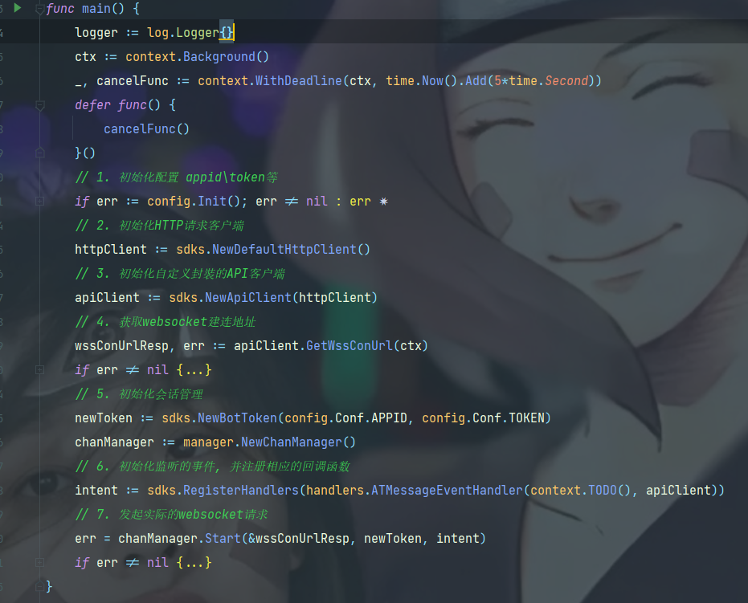
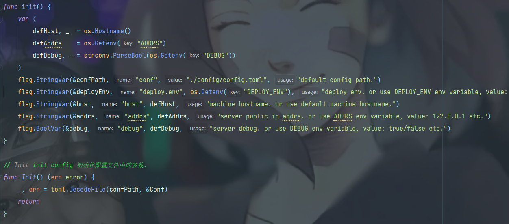
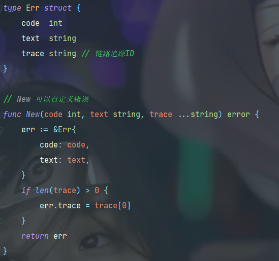
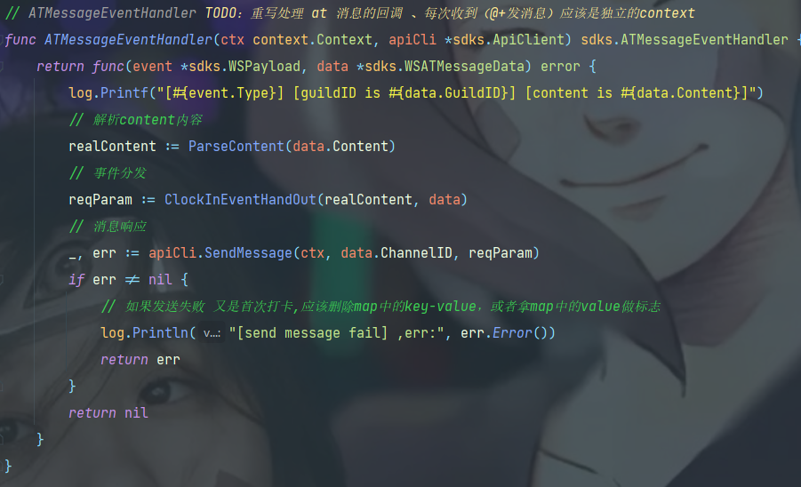
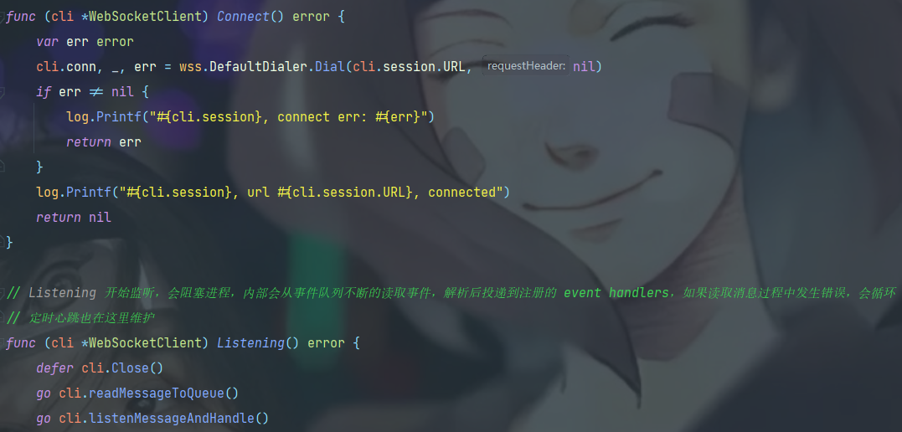
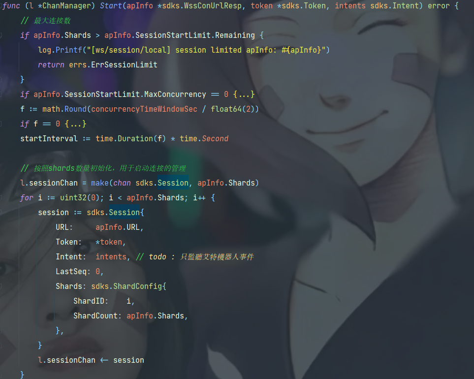
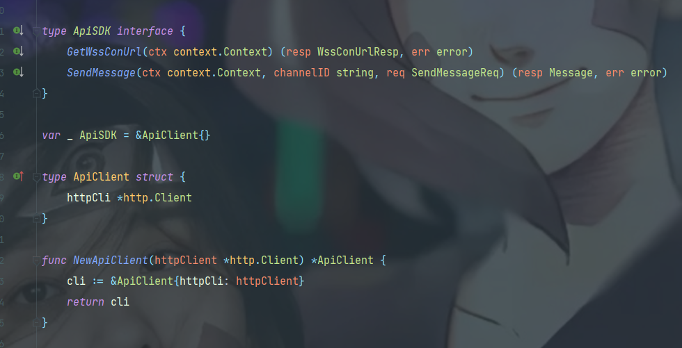
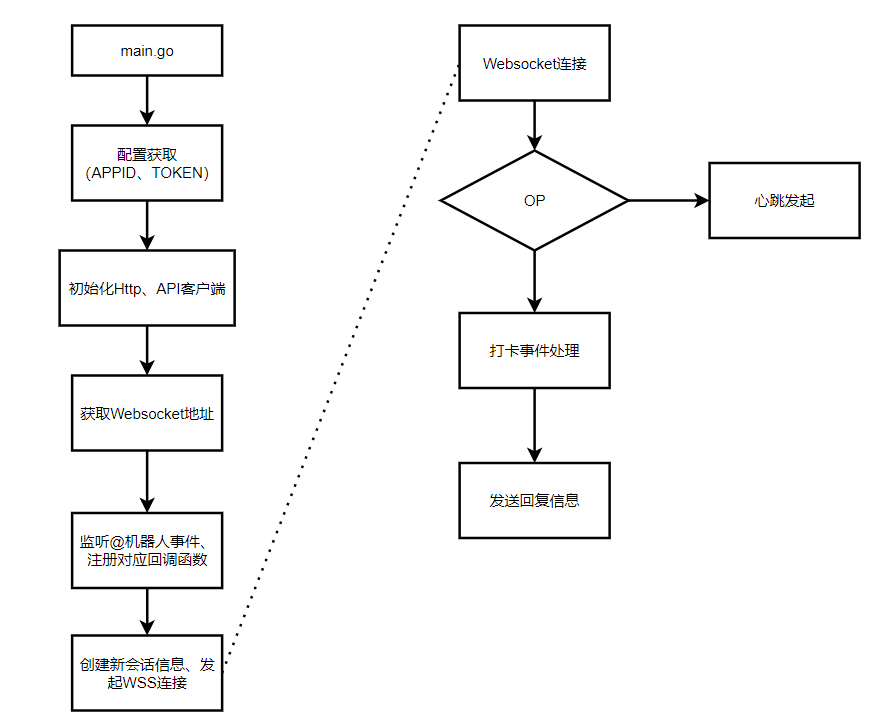

# BotGo-Demo

自定义QQ频道机器人（接收@机器人 指令,做相应事件处理后响应用户消息）

参考1：:
https://github.com/tencent-connect/botgo

参考2：
https://blog.csdn.net/qq_47452807/article/details/126053585

## 重点介绍

### 1 ./cmd/server 项目入口
直接拉取项目便可以运行;

### 2 ./config 管理项目配置项
加载配置文件,支持多种配置文件类型;
如若想更换自己的机器人，请修改config.toml文件中APPID、TOKEN即可;

### 3 ./err 自定义错误格式
可自定义错误格式;

### 4 ./internal/handlers 回调事件
实际处理"@机器人"指令的Func所在, 修改业务逻辑只需调整对应的事件Func即可。

### 5 ./internal/sdks/websocket 长连接模块
实际上处理长连接的建立、鉴权和心跳回包等逻辑。

### 6 ./internal/sdks/manager 长连接管理
会话和长连接建立等的管理。

### 7 ./internal/sdks/api 官方API接口封装
目前封装：websocket连接地址获取, 消息发送接口

大致流程图

